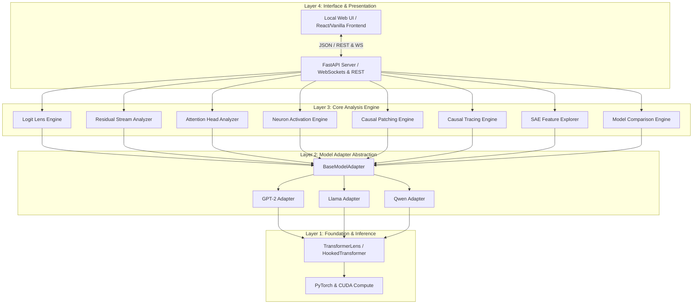

# InterpLens Architecture & Technical Blueprint

**InterpLens** is an interactive mechanistic interpretability Python package and debugger web interface built on top of [TransformerLens](https://github.com/TransformerLensOrg/TransformerLens) and PyTorch. It enables researchers to inspect, visualize, and perform causal experiments on decoder-only LLMs through a unified local web UI.

---

## 1. System Architecture Overview

InterpLens follows a clean 4-tier decoupled architecture:

---

## 2. Architectural Layers

### Layer 1: Model Engine Layer
- **Core Dependency:** `TransformerLens` (`HookedTransformer`) + `torch`.
- **Responsibility:** Handles raw weight loading, tokenization, device allocation (CPU/CUDA/MPS), low-level PyTorch hooks, and hooked forward passes.
- **Isolation:** Never directly called by UI code. All calls pass through Layer 2 adapters.

### Layer 2: Model Adapter Layer (`interplens.adapters`)
- **Abstract Class:** `BaseModelAdapter`
- **Key Duties:**
  1. Standardizes hook point naming across model families (e.g. standardizing layer residual stream names `blocks.L.hook_resid_post`).
  2. Wraps model execution into cached activation sessions (`RunSession`).
  3. Provides unified methods for:
     - `tokenize(prompt: str) -> List[str]`
     - `run_with_cache(prompt: str) -> ActivationCache`
     - `compute_logit_lens(prompt: str) -> LogitLensResult`
     - `get_attention_patterns(prompt: str, layer: int) -> Tensor`
     - `get_neuron_activations(prompt: str, layer: int) -> Tensor`
     - `run_activation_patching(clean: str, corrupt: str, target: HookPoint) -> PatchResult`

### Layer 3: Core Analysis Layer (`interplens.analysis`)
- Standalone stateless functions/classes consuming `BaseModelAdapter` and returning structured Pydantic DTOs for visual rendering.
- Modules:
  - `logit_lens.py`: Unembeds intermediate layer activations to compute top-K tokens & probabilities.
  - `residual_stream.py`: Calculates norm/variance/PCA trajectories across positions and layers.
  - `attention_heads.py`: Prepares $N \times N$ attention weight matrices and arc representation payloads.
  - `neurons.py`: Ranks top firing neurons per token and token-activation lighting strips.
  - `causal_patching.py`: Implements activation swapping between clean and corrupted prompts.
  - `causal_tracing.py`: Sweeps activation patching across layers/positions for ROME-style importance maps.
  - `sae_explorer.py`: Decomposes residual stream vectors using pretrained Sparse Autoencoders (SAEs).
  - `comparison.py`: Syncs dual-model execution and computes tensor diffs.

### Layer 4: Interface & Presentation Layer (`interplens.server` & `interplens.ui`)
- **FastAPI Web Server:** Exposes endpoints for prompt execution, caching, analysis fetching, and model configuration.
- **Embedded Web UI:** Served directly by FastAPI on `http://localhost:8501` (or user-specified port).
- **Session Cache Manager:** Prevents redundant GPU forward passes by keeping prompt activation caches in RAM/VRAM with LRU eviction.

---

## 3. Data Flow & Execution Lifecycle

1. **User Action:** User inputs prompt `"The Eiffel Tower is in"` into Web UI and clicks **Run**.
2. **REST Call:** Frontend POSTs to `/api/run` with `{ prompt, model_name }`.
3. **Session Caching:** Server checks LRU cache. If missed, `BaseModelAdapter.run_with_cache()` executes a single hooked forward pass on `HookedTransformer`.
4. **Token & Layer Metadata:** Returns tokenized strings `["<|endoftext|>", "The", " Eiffel", " Tower", " is", " in"]` and model parameters.
5. **View Loading:** When user switches sidebar tab (e.g., Logit Lens), frontend requests `/api/analysis/logit-lens?session_id=XYZ`.
6. **Zero-Inference Analysis:** Backend retrieves cached activation tensors, computes unembedding projections, and returns JSON payload in < 50ms.
7. **Chart Rendering:** Web UI renders interactive Plotly/D3 heatmaps, ribbons, and bar charts.

---

## 4. Key Design Decisions & Quality Guarantees

- **Zero Duplicate Computations:** Model runs ONCE per prompt. All 8 analysis views read from the same `ActivationCache`.
- **Memory Safety:** Activation caches can be large (~500MB to 2GB per prompt for larger models). The backend uses an LRU Session Store with configurable VRAM/RAM limits (`MAX_CACHED_SESSIONS=3`) and CPU offloading.
- **Framework Independence for Frontend:** The UI is pre-compiled into static HTML/JS/CSS assets bundled within `interplens/ui/dist`, meaning PyPI users need zero Node.js/npm dependencies to run the debugger.

---

## 5. In-Memory GPU Attachment (Zero-Copy Researcher Workflow)

A primary use case for researchers is inspecting a model that is **already loaded in GPU memory** inside a Python script or Jupyter Notebook.

### How In-Memory Attachment Works
1. **Direct Pointer Injection:** When a user calls `interplens.launch(model=my_gpu_model)` or `interplens.attach(my_gpu_model)`, `interplens` wraps the existing model instance in an `InPlaceModelAdapter`.
2. **Zero Weight Re-allocation:** No weights are re-downloaded or duplicated in VRAM. The adapter executes hooked forward passes directly on the existing `HookedTransformer` / `torch.nn.Module`.
3. **Background Threaded Server:** `interplens.launch()` starts the FastAPI server in a background daemon thread (`uvicorn.Server`) directly inside the researcher's running Python process.
4. **Notebook & Script Compatibility:** Works seamlessly inside Jupyter Notebooks, VS Code Interactive Window, or standalone training/probing scripts without interrupting the researcher's active session.

---

## 6. Custom & Experimental Model Support Architecture

When a researcher builds a novel custom model (e.g., custom Gated MLPs, custom positional embeddings, modified attention mechanisms, or non-standard PyTorch `nn.Module`s):

1. **Subclassing `BaseModelAdapter`:** The researcher defines custom layer mappings for residual streams, attention blocks, and unembedding projections.
2. **`PyTorchAutoHooker` System:** Native PyTorch `register_forward_hook()` interception automatically records activations across `nn.ModuleList` or `nn.Sequential` submodules even without `TransformerLens` underlying support.
3. **Dynamic Hook Point Inspection:** The InterpLens backend automatically introspects tensor names and module shapes (`model.named_modules()`), making custom architectures explorable in the UI without modifying core backend code.

